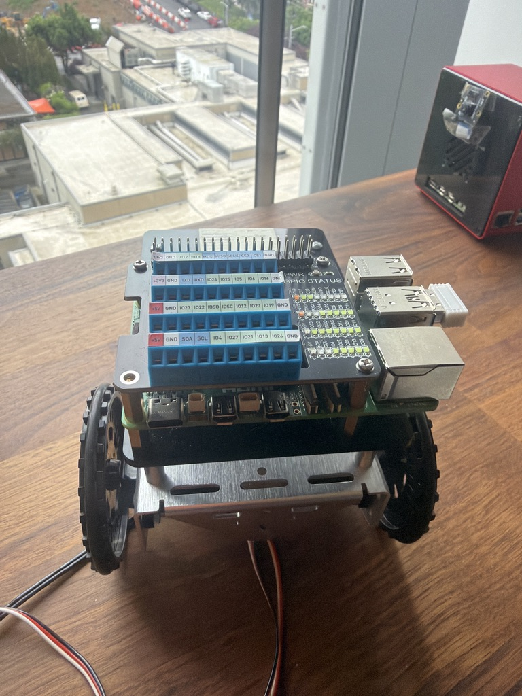

# AEGIS
**Autonomous Edge Ground Intelligence System**

Ezekiel A. Mitchell
May 2026

---

<p align="center">
  
</p>

---

## Abstract

AEGIS is a ground robotics platform for autonomous perimeter patrol and on-device threat detection. The system runs entirely on embedded hardware with no cloud dependency, using a temporal verification layer to reduce false positives before any behavioral response is triggered. The primary research question is whether a low-cost, single-board-computer platform can sustain a reliable perception-to-action pipeline under real-world conditions with an acceptably low false positive rate.

---

## Hardware

| Component | Specification |
|---|---|
| Compute | Raspberry Pi 5, 4GB RAM |
| Storage | 64GB microSD |
| Chassis | Two-wheel differential drive |
| Perception | Raspberry Pi Camera Module |
| I/O | GPIO expansion hat with screw terminal breakout |

---

## Software Stack

| Layer | Technology |
|---|---|
| OS | Ubuntu Server 24.04 LTS (64-bit) |
| Language | Python 3.11+ (perception, verification) |
| Control | Rust crate (`aegis-motor`): motion planning + motor driver, bound via PyO3 |
| Detection | YOLOv8n (Ultralytics) |
| Vision | OpenCV |
| Telemetry | MQTT (optional), local JSON logs |
| Testing | pytest, cargo test |

The entire control loop — behavior/motion planning, the differential-drive
motor driver, and the emergency-stop path — is implemented in Rust
(`crates/aegis-motor`) and compiled to a native Python extension with PyO3.
Python feeds the planner only the verified detection state and target centroid;
all real-time-sensitive control stays out of Python. Perception and the
temporal verification layer remain in Python.

---

## System Architecture

```
Camera Input
    ↓
Perception Module
    ↓
Temporal Verification Layer
    ↓
Behavior Planner
    ↓
Motor Control
    ↓
Telemetry + Logs
```

The temporal verification layer is the core contribution of this system. A single detection frame does not trigger a behavioral response. Confirmation requires N valid detections over a configurable time window with stable bounding box geometry. This approach is intended to suppress transient false positives without introducing unacceptable response latency.

---

## Detection States

| State | Description |
|---|---|
| `NO_TARGET` | No detection present |
| `CANDIDATE` | Detection present, pending verification |
| `CONFIRMED` | Detection verified across required frames |
| `LOST` | Previously confirmed target no longer detected |

---

## Patrol Behaviors

| Behavior | Description |
|---|---|
| `patrol` | Execute waypoint loop |
| `scan` | Rotate in place, observe environment |
| `orient_toward_target` | Rotate to center confirmed target in frame |
| `stop` | Halt all motor output |
| `emergency_stop` | Immediate full stop, disable motor driver |

---

## Repository Structure

```
project-aegis/
├── src/aegis/
│   ├── main.py
│   ├── config.py
│   ├── types.py
│   ├── perception/        # camera, detector, tracker
│   ├── verification/      # temporal filter
│   ├── control/           # Python bindings to the Rust control crate
│   └── telemetry/         # logger, mqtt client
├── crates/
│   └── aegis-motor/       # Rust: behavior planner + motor driver + e-stop (PyO3)
├── configs/
│   └── default.yaml
├── tests/
├── scripts/
├── systemd/
└── docs/
```

---

## Setup

**1. Flash OS**

Ubuntu Server 24.04 LTS (64-bit) via Raspberry Pi Imager.

**2. Install dependencies**

```bash
bash scripts/install_pi_dependencies.sh
```

**3. Configure**

Edit `configs/default.yaml`. Set `simulation_mode: true` until hardware is verified.

**4. Run**

```bash
bash scripts/run_aegis.sh
```

### Local development (no Pi)

The pipeline runs anywhere in simulation mode. Build the Rust motor extension
into your environment, then run the tests:

```bash
pip install -e ".[dev]"
maturin develop -m crates/aegis-motor/Cargo.toml   # builds the aegis_motor module
PYTHONPATH=src pytest                               # Python suite
cargo test --manifest-path crates/aegis-motor/Cargo.toml   # Rust suite
```

> On macOS with a conda/non-framework Python, the `cargo test` runner needs to
> find libpython at runtime:
> `DYLD_FALLBACK_LIBRARY_PATH="$(python -c 'import sysconfig;print(sysconfig.get_config_var("LIBDIR"))')" cargo test ...`

---

## Configuration

Key parameters in `configs/default.yaml`:

```yaml
simulation_mode: true
camera_index: 0
target_class: person
confidence_threshold: 0.55
required_consecutive_frames: 4
max_missed_frames: 8
motor_speed_default: 0.4
telemetry_enabled: true
mqtt_enabled: false
debug: false
```

---

## Metrics

The following are tracked per session:

- Detection confidence distribution
- False positive rate (unverified candidates / total detections)
- Mean time to confirmation (frames)
- Inference latency (ms/frame)
- CPU temperature under load
- Behavior state transition log

---

## Milestones

- [ ] Ubuntu 24.04 + dependencies installed on Pi 5
- [ ] Camera publishing stable frames
- [ ] Detector running at target FPS
- [ ] Temporal verification filter tested and tuned
- [ ] Motor control verified on hardware
- [ ] Patrol + orient behaviors integrated
- [ ] Full pipeline demo recorded
- [ ] Telemetry log analysis complete

---

## Safety

Motors are disabled by default. The `simulation_mode` flag must be explicitly set to `false` in config before any motor output is enabled. Emergency stop is available at all times and takes priority over all other behavior states. Hardware GPIO calls are stubbed until physical pin mapping is confirmed.

---

## Roadmap

- ROS2 Jazzy integration (Nav2, ros2_control)
- ONNX Runtime optimized inference
- GPS-denied dead reckoning via wheel odometry
- Multi-target tracking
- MQTT command and control bridge
- Onboard rosbag-equivalent logging for post-mission replay

---

## License

MIT
